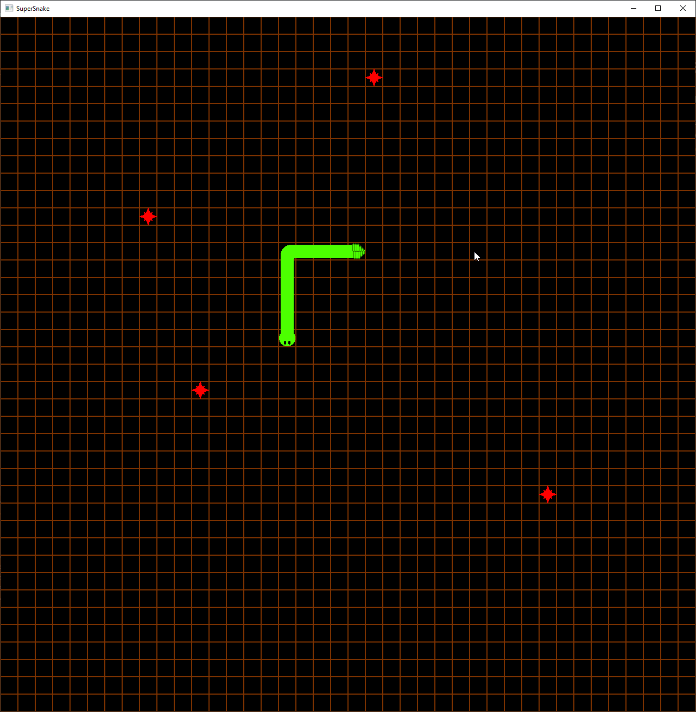

# Core Game
 

In case everyone doesn't know, the mechanics of the game snake consist of:
*   A snake that in controlled by the four directional keys (buttons will be added later)
*   The snakes head moves around the field followed by the snakes body.
*   If the snake hits the edge of the map or it's own tail it grows
*   The map has food scattered randomly.
*   If the snake hits the food, it grows longer and a new food is randomly placed. 

The core game code can be found [here](https://github.com/mrhatman/SuperSnake/tree/Core-Game)!

## Basics of Implementation
### Audio
The audio system is almost identical to the Pong example.
### Direction & DirectionChangeSystem 
This enum stores the 4 directions the snake can be moving.

This system changes the current direction of the snake based on direction keys

    input.key_is_down(VirtualKeyCode::Up) 

unless the direction is opposite of the previous movement direction.

### Food
This struct contains a set of the food pellets. A HashSet is used for performance reasons.

Whenever the snakes head moves, we can use the .contains() function of the set to determine if
the set contains that point. The helper function add_random_pellet() can be used to insert new food unless food already 
exists there or it's part of the snake.

### MoveSystem
This system uses the Time Resource so it only moves the system each MOVEMENT_PERIOD.

The system pushes to the front a new snake head in the direction in the direction of snake.direction. If the snake would
go off the map or intersect with itself, transition the GameState to GameOver. If the snakes head intersects with a 
food pellet, remove the food pellet and add a random one. 
Unless the snake ate a pellet, pop the tail of the snake off, moving it along.

### Snake
The Snake struct contains the current direction of travel, a queue of past directions, and a queue of past points.

### Tile 
 This trait implementation defines of to draw the tile map. 
 Layer 0 is the background so it's a constant grid. Layer 1 contains the snake and food. The snake's
 direction queue is used to determine what part to draw. 
 
### UI 
Contains the Entities for the Big and Little Test that come up on the screen.
 
### Primary State
The primary game state. It loads the files, handles the game state, and takes some basic inputs.

The GameState is the base state of the game.
* Waiting to start: Waiting to start the game. Transitions to Playing when the Spacebar is pressed.
* Playing: Playing the game. The direction system and movement system only run in this state.
* Paused: Pressing P pauses the game and spacebar resumes.
* GameOver: Game is over. Transitions in the movement state.